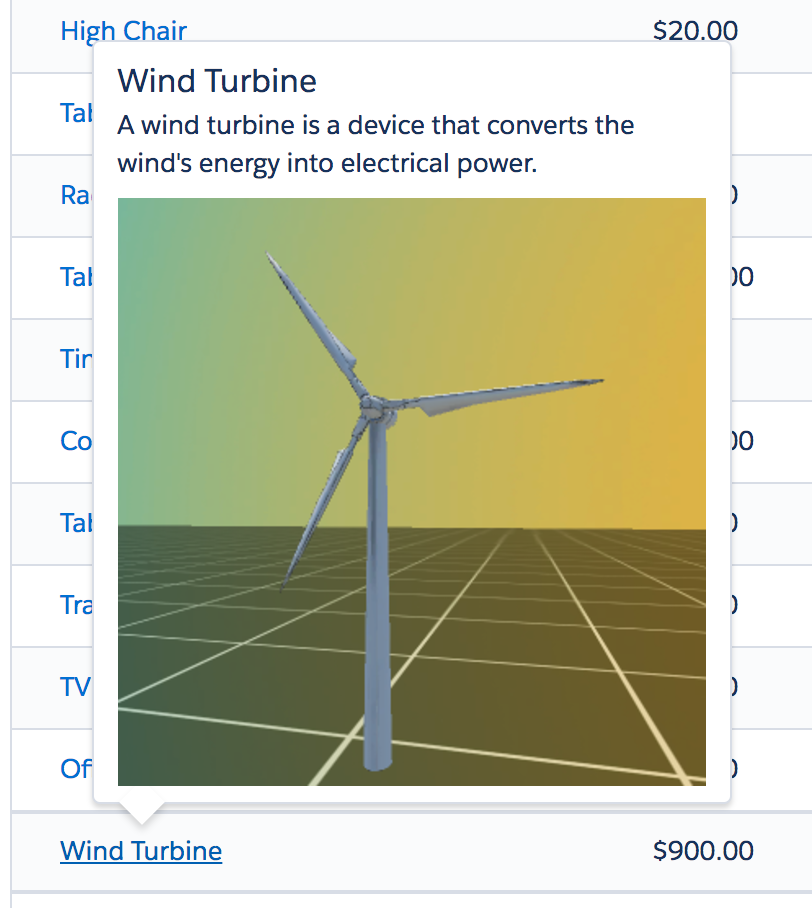
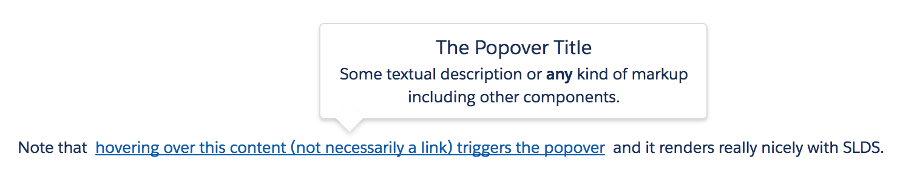

# Salesforce Lightning Popover Component



## About
This is a generic popover (tooltip) component built using Salesforce Lightning.<br/>
This component is built with [SLDS](https://www.lightningdesignsystem.com/) style and does not rely on third party libraries.

<b>Features</b>

The Lightning Popover component provides the following features:
- support for any kind of markup in popover dialog
- high performance thanks to a pure CSS implementation

## Install
Install the Lightning Popover component as a managed package by clicking on this button:

<a href="https://login.salesforce.com/packaging/installPackage.apexp?p0=04t0Y000000xSXm">
  
</a>

## Documentation
Component is documented using the Aura documentation.
You can access it from this URL (replace the domain):
https://<b>&lt;YOUR_DOMAIN&gt;</b>.lightning.force.com/auradocs/reference.app#reference?descriptor=ui_popover:popover&defType=component

# Sample application
Paste the following code in a new Lightning Application to try it out:

``` xml
<aura:application extends="force:slds">
	<div style="text-align:center; margin-top:300px;">Note that&nbsp;
    <ui_popover:popover>
        <aura:set attribute="popoverBody">
            <h3 class="slds-section-title">The Popover Title</h3>
            <p class="slds-m-bottom--x-small">Some textual description or <b>any</b> kind of markup including other components.</p>
        </aura:set>
        <a href="javascript:void(0);">hovering on this content (not necessarily a link) triggers the popover</a>
    </ui_popover:popover>
&nbsp;and it renders really nicely with SLDS.</div>
</aura:application>
```

It will render like this:


